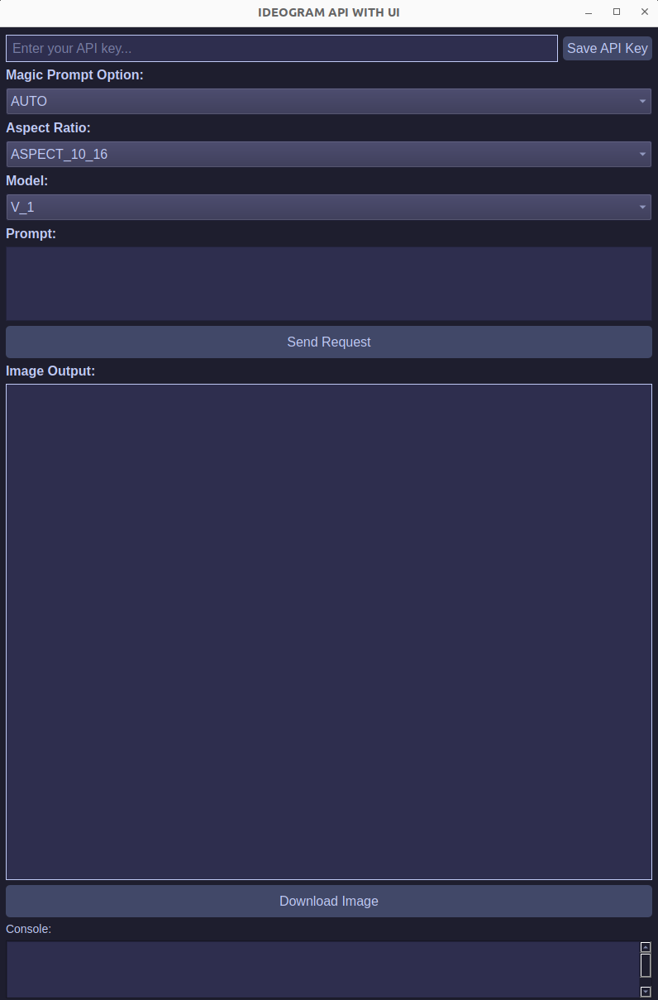

# ideogram-api-ui

**ideogram-api-ui** is a modern, user-friendly graphical user interface for interacting with the Ideogram API. Designed with simplicity and usability in mind, this application allows users to input prompts, configure settings, and view detailed responses from the API in a sleek, futuristic UI. It aims to enhance the API's accessibility for developers and non-developers alike.

> **Disclaimer**: This is not an official application of the Ideogram API. It is an independent project created to simplify API usage.



---

## Features
- **Interactive UI** with a modern, futuristic design.
- **API Key Management**: Save and load API keys for convenience.
- **Console Output**: View detailed API responses, including generated image URLs and metadata.
- **Customizable Options**: Adjust magic prompt options, aspect ratios, and models directly from the interface.

---

## Prerequisites
- Python 3.6 or higher.

---

## Installation

1. **Clone the Repository**
   ```bash
   git clone https://github.com/enescingoz/ideogram-api-ui.git
   cd ideogram-api-ui
   ```

2. **Install Required Libraries**
   ```bash
   pip3 install PyQt5 requests
   ```

3. **Run the Application Execute the script**
   ```bash
   python3 ideogram_api_ui.py
   ```
---
## Required Libraries
- PyQt5: For building the modern GUI.
- requests: For sending HTTP requests to the API.
---
## Usage Instructions
1. Enter your API key in the provided textbox or save it for future use.
2. Select desired options for:
- Magic Prompt
- Aspect Ratio
- Model
3. Input your prompt in the text area.
4. Click Send Request to generate the API call.
5. View the URL and response details in the console.

---
## Example Response Display
When a request is successfully processed, the application will display the following:

- URL: Link to the generated image.
- Style: Style type of the generated image.
- Resolution: Resolution of the generated image.
- Seed: Seed used for the generation.
- Image Safety: Indicates whether the image is safe.
---

## Author
Developed by [Enes Cingoz.](https://github.com/enescingoz)